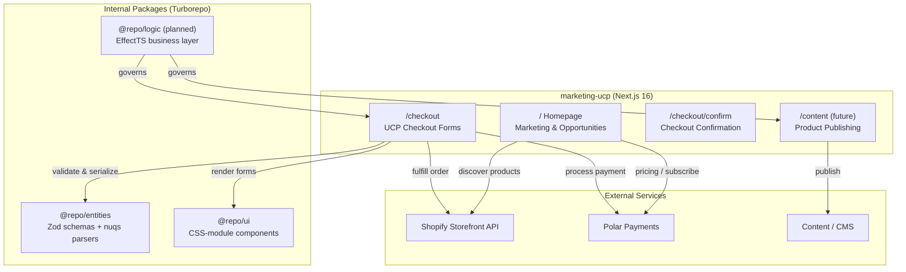
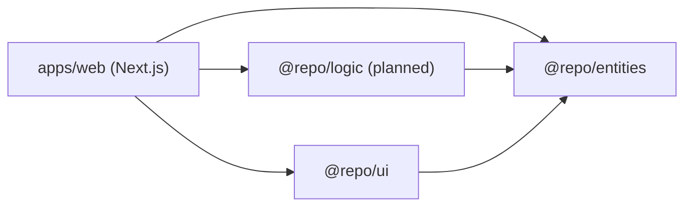
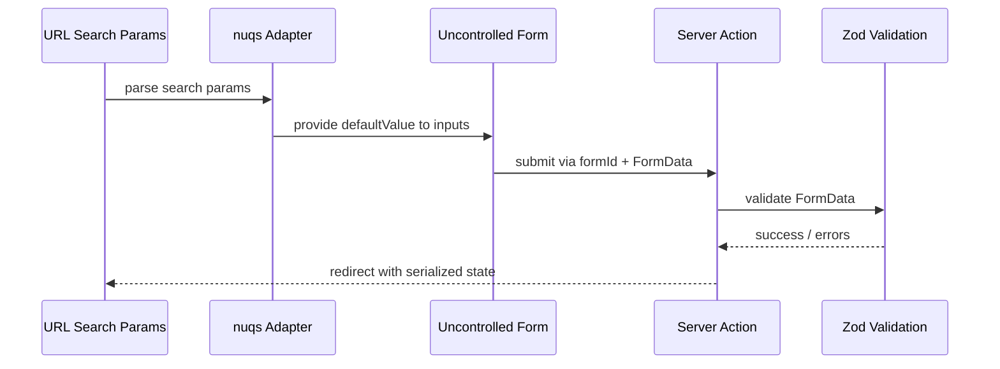

# Architecture Overview

## System Context

## Monorepo Package Graph

## Route Structure

| Route | Purpose | State Source |
|---|---|---|
| `/` | Marketing homepage, service opportunities | static / CMS |
| `/checkout` | UCP checkout forms (buyer, address, payment) | nuqs URL params |
| `/checkout/confirm` | Checkout summary & confirmation | nuqs URL params |
| `/content` (planned) | Product creation & publishing | server / CMS |

## Data Flow: Stateless URL-Driven Forms

