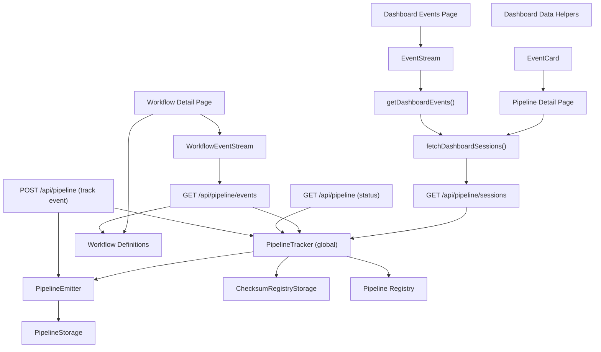
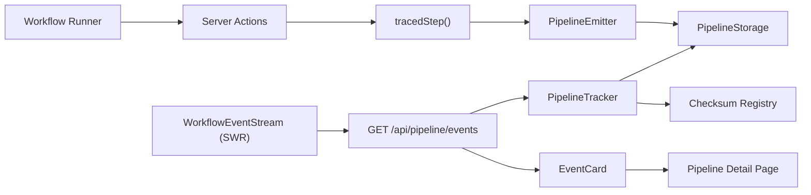
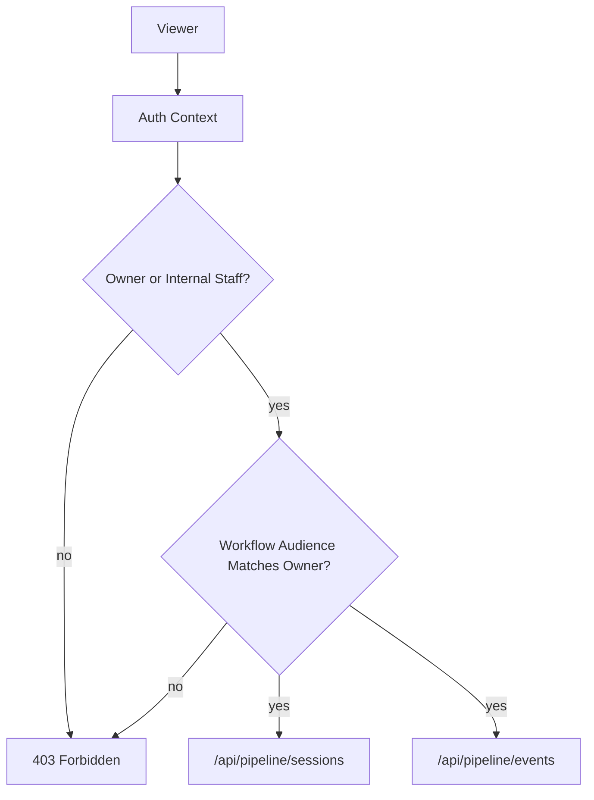

# Dashboard Utility Entity Relationships

This document maps the core entities that power the dashboard observability views and how they relate across UI, data helpers, API routes, and pipeline storage. It is intended as a quick reference for developers wiring new views or debugging event flows.

## High-level overview

- UI pages rely on lightweight client components that render server-provided data or poll API routes for live updates.
- Server helpers in the dashboard layer aggregate session and event data for SSR pages.
- API routes read from the in-memory or KV-backed pipeline tracker to provide real-time session and event snapshots.
- The pipeline tracker delegates persistence to a storage layer and computes checksum registry state for verification.

## Entity diagram

## Entity notes

### UI surfaces

- Dashboard events page renders a global event feed via `EventStream`.
- Workflow detail pages can embed `WorkflowEventStream` for live activity, but workflows should not depend on it for correctness.
- Pipeline detail pages render session-level state and historical timelines.

### Dashboard data helpers

- `fetchDashboardSessions()` pulls session summaries from the sessions API route.
- `getDashboardEvents()` flattens session events into a reverse-chronological list.
- These helpers are server-only and meant for SSR pages.

### API routes

- `/api/pipeline/sessions` returns grouped session summaries (events + checksum).
- `/api/pipeline/events` returns flattened events with optional filters for workflow, pipeline, session, and time range.
- `/api/pipeline` supports both a status summary GET and a POST for event tracking.

### Pipeline core

- `PipelineTracker` is the single aggregation point. It reads events, computes checksums, and exposes status summaries.
- `PipelineEmitter` writes events to the configured storage backend.
- Storage is either in-memory (local dev) or KV-backed (production).

### Workflow registry

- Workflow definitions map workflow IDs to pipeline types.
- The events API uses the registry to translate a workflow filter into a pipeline type filter.

## Data flow summary

1. A workflow step triggers a pipeline event via the pipeline emitter.
2. The tracker stores the event and updates checksum state.
3. The dashboard reads sessions or events via API routes.
4. UI components render SSR summaries or poll for live updates.

## Usage patterns

- Use `WorkflowEventStream` when you need live updates; do not require it for workflow execution.
- Prefer `/api/pipeline/events` for cross-session views and `/api/pipeline/sessions` for session-specific dashboards.
- For debugging, correlate `session_id`, `pipeline_type`, and `chain_hash` between event cards and pipeline detail pages.

## Access model assumptions

- `session_id` is not a public key. It identifies a session but does not grant access by itself.
- Checksums validate integrity of event data; they are not used for access control.
- Events should be scoped to an `owner_id` (or workspace) and optionally shared with internal staff roles.
- Workflow audience should be checked against `owner_id` to ensure the viewer is allowed to see the session.
- Participants must be authorized by role (owner or internal staff) before the API returns events or sessions.

## Workflow event stream flow

## RBAC gate (conceptual)

