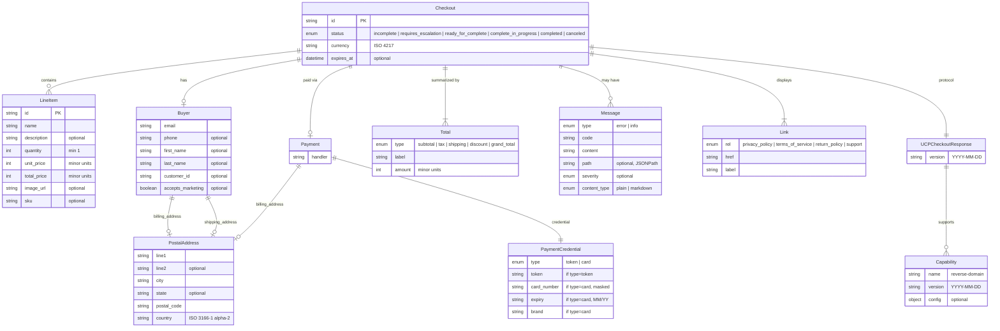
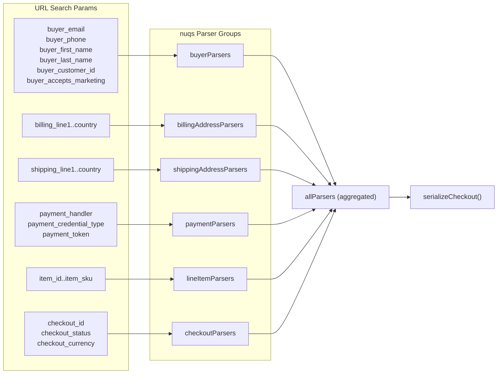

# Entity Model (Zod Schemas)

## Core Entity Relationships

## nuqs Parser Mapping

Each entity field maps to a flat URL search parameter. The naming convention
uses a `{entity}_{field}` prefix to avoid collisions.

