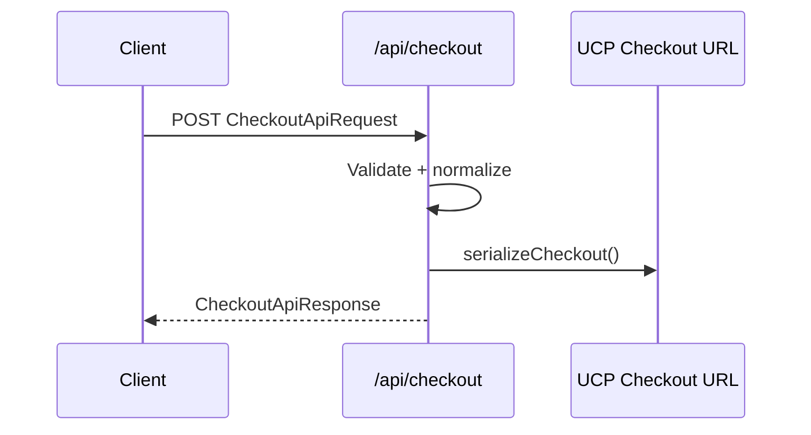

# Headless Checkout API

The headless checkout API accepts a normalized cart payload and returns a validated UCP checkout object plus a shareable checkout URL.

## Endpoint
`POST /api/checkout`

## Request
```json
{
  "currency": "USD",
  "locale": "en-US",
  "buyer": {
    "email": "buyer@example.com",
    "first_name": "Alex",
    "last_name": "Smith"
  },
  "line_items": [
    {
      "id": "item_001",
      "name": "Starter Plan",
      "quantity": 1,
      "unit_price": 2500
    }
  ]
}
```

## Response
```json
{
  "checkout": {
    "id": "chk_...",
    "line_items": [
      {
        "id": "item_001",
        "name": "Starter Plan",
        "quantity": 1,
        "unit_price": 2500,
        "total_price": 2500
      }
    ],
    "status": "incomplete",
    "currency": "USD",
    "totals": [
      { "type": "subtotal", "label": "Subtotal", "amount": 2500 },
      { "type": "grand_total", "label": "Total", "amount": 2500 }
    ],
    "links": [
      {
        "rel": "privacy_policy",
        "href": "https://example.com/privacy",
        "label": "Privacy Policy"
      },
      {
        "rel": "terms_of_service",
        "href": "https://example.com/terms",
        "label": "Terms of Service"
      }
    ],
    "ucp": {
      "version": "2025-01-01",
      "capabilities": [
        { "name": "com.ucp.checkout", "version": "2025-01-01" },
        { "name": "com.ucp.checkout.headless", "version": "2025-01-01" }
      ]
    }
  },
  "checkout_url": "/checkout?checkout_currency=USD&item_name=Starter+Plan",
  "totals": [
    { "type": "subtotal", "label": "Subtotal", "amount": 2500 },
    { "type": "grand_total", "label": "Total", "amount": 2500 }
  ],
  "ucp": {
    "version": "2025-01-01",
    "capabilities": [
      { "name": "com.ucp.checkout", "version": "2025-01-01" },
      { "name": "com.ucp.checkout.headless", "version": "2025-01-01" }
    ]
  },
  "locale": "en-US"
}
```

## Flow

