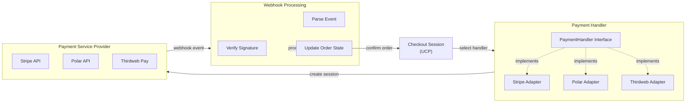
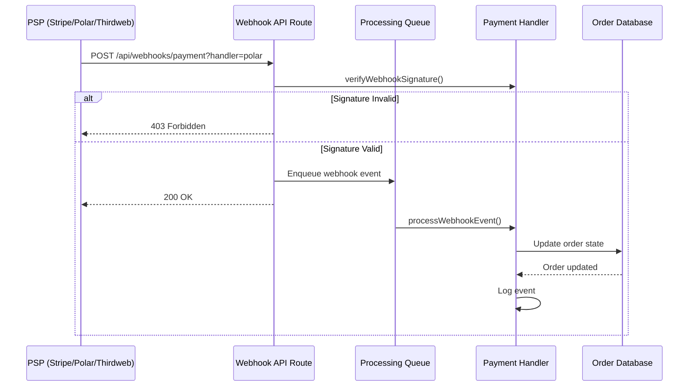
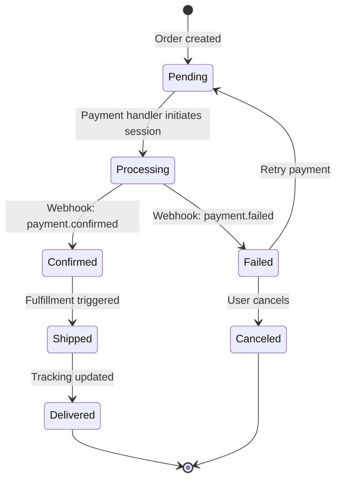

# Payment Handlers & Webhooks Integration Guide

## Overview

This document explains how to integrate payment handlers and process webhooks within UCP, enabling seamless payment processing across web2 (Stripe, Polar) and web3 (Thirdweb) providers.

## UCP Payment Architecture



## Payment Handler Interface

All payment handlers implement this interface:

```typescript
interface PaymentHandler {
  // Create a payment session with the provider
  createPaymentSession(order: Order): Promise<{
    sessionId: string;
    clientSecret?: string;
    paymentUrl?: string;
    metadata?: Record<string, unknown>;
  }>;

  // Verify webhook authenticity
  verifyWebhookSignature(body: string, signature: string): Promise<boolean>;

  // Process incoming webhook event
  processWebhookEvent(event: WebhookEvent): Promise<Partial<Order>>;

  // Cancel or refund a payment
  cancelPayment(orderId: string, amount?: number): Promise<{
    refundId: string;
    status: 'success' | 'pending' | 'failed';
  }>;

  // Get current payment status
  getPaymentStatus(orderId: string): Promise<{
    status: 'pending' | 'succeeded' | 'failed' | 'refunded';
    amount: number;
    currency: string;
  }>;
}
```

## Supported Handlers

### 1. Stripe (Web2 - Card Payments)

**Use case:** Credit cards, debit cards, Apple Pay, Google Pay.

```typescript
import { StripePaymentHandler } from '@repo/entities/adapters/stripe';

const handler = new StripePaymentHandler(
  process.env.STRIPE_API_KEY!,
  process.env.STRIPE_WEBHOOK_SECRET!
);

registerPaymentHandler('stripe', handler);
```

**Webhook events:**
- `checkout.session.completed` → Order status: `confirmed`
- `charge.refunded` → Order status: `refunded`
- `charge.dispute.created` → Order status: `failed`

**Reference:** [Stripe Webhooks](https://stripe.com/docs/webhooks)

### 2. Polar (Web2 - Subscriptions & Digital Products)

**Use case:** SaaS subscriptions, digital products, course sales.

```typescript
import { PolarPaymentHandler } from '@repo/entities/adapters/polar';

const handler = new PolarPaymentHandler(
  process.env.POLAR_API_KEY!,
  process.env.POLAR_WEBHOOK_SECRET!
);

registerPaymentHandler('polar', handler);
```

**Webhook events:**
- `order.created` → Order status: `pending`
- `payment.confirmed` → Order status: `confirmed`
- `order.refunded` → Order status: `refunded`

**Reference:** [Polar Webhooks](https://docs.polar.sh/api-reference/webhooks)

### 3. Thirdweb (Web3 - Crypto & NFT Payments)

**Use case:** Cryptocurrency payments, NFT settlements, blockchain transactions.

```typescript
import { ThirdwebPaymentHandler } from '@repo/entities/adapters/thirdweb';

const handler = new ThirdwebPaymentHandler(
  process.env.THIRDWEB_API_KEY!,
  process.env.THIRDWEB_WEBHOOK_SECRET!,
  1 // Ethereum mainnet chain ID
);

registerPaymentHandler('thirdweb', handler);
```

**Webhook events:**
- `payment.confirmed` → Order status: `confirmed`, includes `transactionHash` and `walletAddress`
- `payment.failed` → Order status: `failed`

**Supported chains:**
- Ethereum (1), Polygon (137), Arbitrum (42161), Optimism (10), Base (8453)

**Reference:** [Thirdweb Pay API](https://thirdweb.com/pay)

## Webhook Processing Pipeline



### Example: Handling a Stripe Webhook

```typescript
// app/api/webhooks/payment/route.ts
import { NextRequest, NextResponse } from 'next/server';
import { getPaymentHandler } from '@repo/entities';
import { WebhookEventSchema } from '@repo/entities';

export async function POST(req: NextRequest) {
  const body = await req.text();
  const handlerName = req.nextUrl.searchParams.get('handler') ?? req.headers.get('x-ucp-handler');
  const signature = req.headers.get('x-ucp-signature') ?? req.headers.get('stripe-signature');
  
  const handler = handlerName ? getPaymentHandler(handlerName) : undefined;
  if (!handler) return NextResponse.json({ error: 'Handler not found' }, { status: 404 });
  
  // Verify signature
  const isValid = await handler.verifyWebhookSignature(body, signature);
  if (!isValid) return NextResponse.json({ error: 'Invalid signature' }, { status: 403 });
  
  // Parse and process event
  const event = JSON.parse(body);
  const result = await handler.processWebhookEvent({
    type: event.type,
    timestamp: new Date(event.created * 1000).toISOString(),
    source: 'stripe',
    data: event.data,
  });
  
  // Update order in database
  // await db.orders.update(event.data.metadata.orderId, result);
  
  return NextResponse.json({ success: true });
}
```

## Order Lifecycle with Webhooks



## Error Handling & Retries

### Webhook Retry Strategy

- **Attempt 1:** Immediate
- **Attempt 2:** After 5 minutes
- **Attempt 3:** After 30 minutes
- **Attempt 4:** After 2 hours
- **Fail:** After 4 attempts

```typescript
// app/api/webhooks/payment/route.ts
async function processWebhookWithRetry(
  event: WebhookEvent,
  maxRetries = 3,
  attempt = 0
) {
  try {
    const handler = getPaymentHandler(event.source);
    await handler.processWebhookEvent(event);
  } catch (error) {
    if (attempt < maxRetries) {
      const delayMs = [5, 30, 120][attempt] * 60 * 1000; // 5m, 30m, 2h
      setTimeout(() => processWebhookWithRetry(event, maxRetries, attempt + 1), delayMs);
    } else {
      // Log failed webhook for manual review
      console.error(`Failed webhook after ${maxRetries} retries:`, event.id);
    }
  }
}
```

## Security Considerations

### 1. Signature Verification
Always verify webhook signatures using the provider's secret:

```typescript
// Stripe example (pseudocode)
const signature = req.headers['stripe-signature'];
const event = stripe.webhooks.constructEvent(body, signature, secret);
```

### 2. Idempotency
Use webhook event IDs to prevent duplicate processing:

```typescript
// Check if event was already processed
const existing = await db.webhookEvents.findOne({ externalId: event.id });
if (existing) {
  return NextResponse.json({ success: true }); // Already processed
}

// Process event
await processWebhookEvent(event);

// Mark as processed
await db.webhookEvents.create({
  externalId: event.id,
  source: event.source,
  processedAt: new Date(),
});
```

### 3. Environment Secrets
Store all secrets in environment variables:

```bash
# .env.local
STRIPE_API_KEY=sk_test_...
STRIPE_WEBHOOK_SECRET=whsec_test_...
POLAR_API_KEY=...
POLAR_WEBHOOK_SECRET=...
THIRDWEB_API_KEY=...
THIRDWEB_WEBHOOK_SECRET=...
```

## Testing Webhook Events

### Using CLI Tools

```bash
# Stripe
stripe trigger payment_intent.succeeded

# Polar (requires account)
curl -X POST http://localhost:3000/api/webhooks/payment \
  -H "Content-Type: application/json" \
  -d '{"type": "order.created", "data": {...}}'

# Thirdweb (via dashboard)
# Thirdweb Pay → Settings → Test Webhook
```

## Extending with Custom Handlers

To add a new payment provider, implement the `PaymentHandler` interface:

```typescript
import type { PaymentHandler } from '@repo/entities';

export class CustomPaymentHandler implements PaymentHandler {
  async createPaymentSession(order: Order) {
    // Call your provider's API
  }

  async verifyWebhookSignature(body: string, signature: string) {
    // Verify signature
  }

  async processWebhookEvent(event: WebhookEvent) {
    // Map event to order state
  }

  async cancelPayment(orderId: string, amount?: number) {
    // Handle cancellation
  }

  async getPaymentStatus(orderId: string) {
    // Query payment status
  }
}

// Register it
import { registerPaymentHandler } from '@repo/entities';
registerPaymentHandler('custom', new CustomPaymentHandler(...));
```

## References

- [UCP Specification - Payment Handlers](https://ucp.dev/specification/payment-handler-guide)
- [Stripe Webhooks](https://stripe.com/docs/webhooks)
- [Polar Webhooks](https://docs.polar.sh/api-reference/webhooks)
- [Thirdweb Pay](https://thirdweb.com/pay)
- [Agent Payments Protocol (AP2)](https://agentpayments.com)
