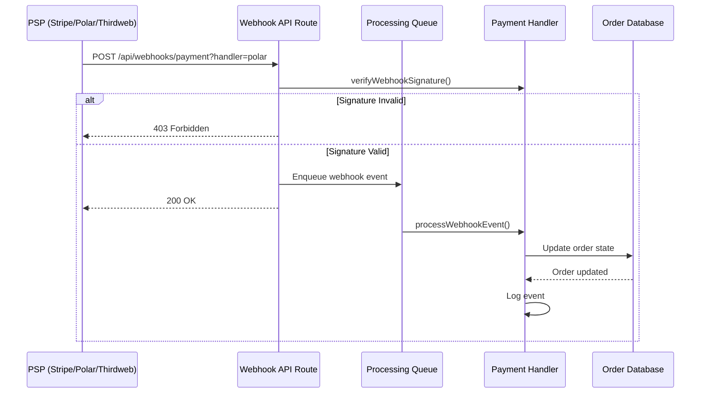
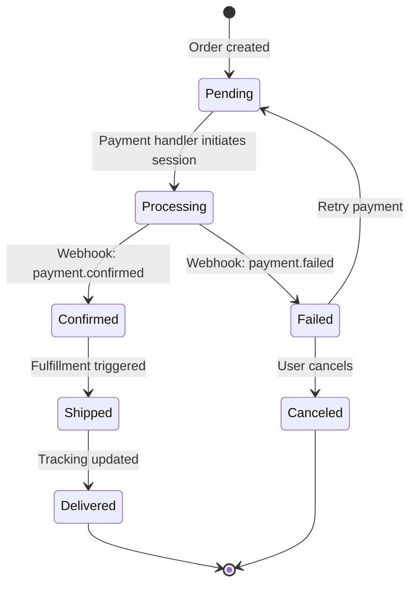

# Payment Handlers & Webhooks Integration Guide

## Overview

This document explains how to integrate payment handlers and process webhooks within UCP, enabling seamless payment processing across web2 (Stripe, Polar), web3 (Thirdweb), and Mexican IFPE (PayPal MX, MercadoPago, Compropago, STP SPEI) providers.

## UCP Payment Architecture

```mermaid
graph LR
    Checkout["Checkout Session<br/>(UCP)"]
    
    subgraph Handler["Payment Handler"]
        direction TB
        Interface["PaymentHandler Interface"]
        Adapter1["Stripe Adapter"]
        Adapter2["Polar Adapter"]
        Adapter3["Thirdweb Adapter"]
        Adapter4["PayPal MX Adapter"]
        Adapter5["MercadoPago Adapter"]
        Adapter6["Compropago Adapter"]
        Adapter7["STP SPEI Adapter"]
        Interface -.->|"implements"| Adapter1
        Interface -.->|"implements"| Adapter2
        Interface -.->|"implements"| Adapter3
        Interface -.->|"implements"| Adapter4
        Interface -.->|"implements"| Adapter5
        Interface -.->|"implements"| Adapter6
        Interface -.->|"implements"| Adapter7
    end
    
    subgraph PSP["Payment Service Provider"]
        direction TB
        Stripe["Stripe API"]
        Polar["Polar API"]
        Thirdweb["Thirdweb Pay"]
    end
    
    subgraph Webhook["Webhook Processing"]
        Verify["Verify Signature"]
        Parse["Parse Event"]
        UpdateOrder["Update Order State"]
    end
    
    Checkout -->|"select handler"| Handler
    Handler -->|"create session"| PSP
    PSP -->|"webhook event"| Webhook
    Webhook -->|"process"| UpdateOrder
    UpdateOrder -->|"confirm order"| Checkout
```



## Payment Handler Interface

All payment handlers implement this interface:

```typescript
interface PaymentHandler {
  // Create a payment session with the provider
  createPaymentSession(order: Order): Promise<{
    sessionId: string;
    clientSecret?: string;
    paymentUrl?: string;
    metadata?: Record<string, unknown>;
  }>;

  // Verify webhook authenticity
  verifyWebhookSignature(body: string, signature: string): Promise<boolean>;

  // Process incoming webhook event
  processWebhookEvent(event: WebhookEvent): Promise<Partial<Order>>;

  // Cancel or refund a payment
  cancelPayment(orderId: string, amount?: number): Promise<{
    refundId: string;
    status: 'success' | 'pending' | 'failed';
  }>;

  // Get current payment status
  getPaymentStatus(orderId: string): Promise<{
    status: 'pending' | 'succeeded' | 'failed' | 'refunded';
    amount: number;
    currency: string;
  }>;
}
```

## Supported Handlers

### 1. Stripe (Web2 - Card Payments)

**Use case:** Credit cards, debit cards, Apple Pay, Google Pay.

```typescript
import { StripePaymentHandler } from '@repo/entities/adapters/stripe';

const handler = new StripePaymentHandler(
  process.env.STRIPE_API_KEY!,
  process.env.STRIPE_WEBHOOK_SECRET!
);

registerPaymentHandler('stripe', handler);
```

**Webhook events:**
- `checkout.session.completed` → Order status: `confirmed`
- `charge.refunded` → Order status: `refunded`
- `charge.dispute.created` → Order status: `failed`

**Reference:** [Stripe Webhooks](https://stripe.com/docs/webhooks)

### 2. Polar (Web2 - Subscriptions & Digital Products)

**Use case:** SaaS subscriptions, digital products, course sales.

```typescript
import { PolarPaymentHandler } from '@repo/entities/adapters/polar';

const handler = new PolarPaymentHandler(
  process.env.POLAR_API_KEY!,
  process.env.POLAR_WEBHOOK_SECRET!
);

registerPaymentHandler('polar', handler);
```

**Webhook events:**
- `order.created` → Order status: `pending`
- `payment.confirmed` → Order status: `confirmed`
- `order.refunded` → Order status: `refunded`

**Reference:** [Polar Webhooks](https://docs.polar.sh/api-reference/webhooks)

### 3. Thirdweb (Web3 - Crypto & NFT Payments)

**Use case:** Cryptocurrency payments, NFT settlements, blockchain transactions.

```typescript
import { ThirdwebPaymentHandler } from '@repo/entities/adapters/thirdweb';

const handler = new ThirdwebPaymentHandler(
  process.env.THIRDWEB_API_KEY!,
  process.env.THIRDWEB_WEBHOOK_SECRET!,
  1 // Ethereum mainnet chain ID
);

registerPaymentHandler('thirdweb', handler);
```

**Webhook events:**
- `payment.confirmed` → Order status: `confirmed`, includes `transactionHash` and `walletAddress`
- `payment.failed` → Order status: `failed`

**Supported chains:**
- Ethereum (1), Polygon (137), Arbitrum (42161), Optimism (10), Base (8453)

**Reference:** [Thirdweb Pay API](https://thirdweb.com/pay)

### 4. PayPal México (IFPE - Online Payments)

**Use case:** Credit/debit cards, PayPal wallet, MXN payments in Mexico.

**Package:** `@repo/paypal-mx`

```typescript
import {
  createPayPalMxClient,
  createPayPalMxPaymentHandler,
  getPayPalMxEnv,
  getPayPalBaseUrl,
} from '@repo/paypal-mx';

const env = getPayPalMxEnv();
const client = createPayPalMxClient({
  clientId: env.clientId,
  clientSecret: env.clientSecret,
  baseUrl: getPayPalBaseUrl(env.environment),
});
const handler = createPayPalMxPaymentHandler({
  client,
  webhookId: env.webhookId,
});
registerPaymentHandler('paypal-mx', handler);
```

**Environment variables:**
- `PAYPAL_MX_CLIENT_ID` — PayPal app client ID
- `PAYPAL_MX_CLIENT_SECRET` — PayPal app secret
- `PAYPAL_MX_WEBHOOK_ID` — PayPal webhook ID for signature verification
- `PAYPAL_MX_ENVIRONMENT` — `sandbox` or `live`

**Webhook events:**
- `CHECKOUT.ORDER.APPROVED` → Order status: `confirmed`
- `PAYMENT.CAPTURE.COMPLETED` → Order status: `confirmed`
- `PAYMENT.CAPTURE.DENIED` → Order status: `failed`
- `PAYMENT.CAPTURE.REFUNDED` → Order status: `refunded`
- `CUSTOMER.DISPUTE.CREATED` → Order status: `failed`

**Reference:** [PayPal REST API](https://developer.paypal.com/docs/api/orders/v2/)

### 5. MercadoPago (IFPE - Checkout Pro)

**Use case:** Cards, wallet, installments (meses sin intereses), offline payments in Mexico.

**Package:** `@repo/mercadopago`

```typescript
import {
  createMercadoPagoClient,
  createMercadoPagoPaymentHandler,
  getMercadoPagoEnv,
} from '@repo/mercadopago';

const env = getMercadoPagoEnv();
const client = createMercadoPagoClient({ accessToken: env.accessToken });
const handler = createMercadoPagoPaymentHandler({
  client,
  webhookSecret: env.webhookSecret,
  environment: env.environment,
});
registerPaymentHandler('mercadopago', handler);
```

**Environment variables:**
- `MERCADOPAGO_ACCESS_TOKEN` — Production or test access token
- `MERCADOPAGO_WEBHOOK_SECRET` — Secret for HMAC-SHA256 verification
- `MERCADOPAGO_ENVIRONMENT` — `sandbox` or `production`

**Webhook events (actions):**
- `payment.created` → Order status: `pending`
- `payment.updated` → Order status: `confirmed`
- `payment.refunded` → Order status: `refunded`
- `chargebacks` → Order status: `failed`

**Installments:** Configure `payment_methods.installments` in the preference input to enable meses sin intereses.

**Reference:** [MercadoPago Developers](https://www.mercadopago.com.mx/developers/es/docs/checkout-pro/landing)

### 6. Compropago (IFPE - Cash & SPEI Payments)

**Use case:** Cash payments at OXXO, 7-Eleven, Coppel; SPEI bank transfers.

**Package:** `@repo/compropago`

```typescript
import {
  createCompropagoClient,
  createCompropagoPaymentHandler,
  getCompropagoEnv,
} from '@repo/compropago';

const env = getCompropagoEnv();
const client = createCompropagoClient({
  apiKey: env.apiKey,
  publicKey: env.publicKey,
});
const handler = createCompropagoPaymentHandler({
  client,
  webhookSecret: env.webhookSecret,
});
registerPaymentHandler('compropago', handler);
```

**Environment variables:**
- `COMPROPAGO_API_KEY` — Private API key
- `COMPROPAGO_PUBLIC_KEY` — Public key
- `COMPROPAGO_WEBHOOK_SECRET` — HMAC-SHA256 secret
- `COMPROPAGO_ENVIRONMENT` — `sandbox` or `live`

**Webhook events:**
- `charge.pending` → Order status: `pending`
- `charge.success` → Order status: `confirmed`
- `charge.expired` → Order status: `canceled`
- `charge.declined` → Order status: `failed`

**Note:** Cash payments cannot be refunded programmatically. `cancelPayment()` returns `status: 'pending'` indicating manual processing is required.

**Reference:** [Compropago API](https://compropago.com/documentacion/api)

### 7. STP SPEI (IFPE - Bank Infrastructure)

**Use case:** Direct SPEI interbank transfers (cobros and dispersiones) via Banxico infrastructure.

**Package:** `@repo/stp`

```typescript
import {
  createStpClient,
  createStpPaymentHandler,
  getStpEnv,
  getStpBaseUrl,
} from '@repo/stp';

const env = getStpEnv();
const client = createStpClient({
  empresa: env.empresa,
  apiKey: env.apiKey,
  baseUrl: getStpBaseUrl(env.environment),
  clabe: env.clabe,
});
const handler = createStpPaymentHandler({
  client,
  webhookSecret: env.webhookSecret,
  empresa: env.empresa,
  clabe: env.clabe,
});
registerPaymentHandler('stp', handler);
```

**Environment variables:**
- `STP_EMPRESA` — Company alias registered in STP
- `STP_API_KEY` — API key / private key for signing
- `STP_WEBHOOK_SECRET` — HMAC-SHA256 secret for notifications
- `STP_CLABE` — CLABE account to receive funds
- `STP_ENVIRONMENT` — `sandbox` or `production`

**Webhook events (estado):**
- `Liquidada` → Order status: `confirmed`
- `Devuelta` → Order status: `refunded`
- `En proceso` → Order status: `pending`
- `Cancelada` → Order status: `canceled`

**Refunds:** STP refunds are executed as reverse SPEI outbound transfers. Requires the original payer's CLABE for reconciliation.

**Currency:** MXN only (SPEI is domestic Mexican infrastructure).

**Reference:** [STP Documentation](https://stpmex.com/documentacion)

## Webhook Processing Pipeline



### Example: Handling a Stripe Webhook

```typescript
// app/api/webhooks/payment/route.ts
import { NextRequest, NextResponse } from 'next/server';
import { getPaymentHandler } from '@repo/entities';
import { WebhookEventSchema } from '@repo/entities';

export async function POST(req: NextRequest) {
  const body = await req.text();
  const handlerName = req.nextUrl.searchParams.get('handler') ?? req.headers.get('x-ucp-handler');
  const signature = req.headers.get('x-ucp-signature') ?? req.headers.get('stripe-signature');
  
  const handler = handlerName ? getPaymentHandler(handlerName) : undefined;
  if (!handler) return NextResponse.json({ error: 'Handler not found' }, { status: 404 });
  
  // Verify signature
  const isValid = await handler.verifyWebhookSignature(body, signature);
  if (!isValid) return NextResponse.json({ error: 'Invalid signature' }, { status: 403 });
  
  // Parse and process event
  const event = JSON.parse(body);
  const result = await handler.processWebhookEvent({
    type: event.type,
    timestamp: new Date(event.created * 1000).toISOString(),
    source: 'stripe',
    data: event.data,
  });
  
  // Update order in database
  // await db.orders.update(event.data.metadata.orderId, result);
  
  return NextResponse.json({ success: true });
}
```

## Order Lifecycle with Webhooks



## Error Handling & Retries

### Webhook Retry Strategy

- **Attempt 1:** Immediate
- **Attempt 2:** After 5 minutes
- **Attempt 3:** After 30 minutes
- **Attempt 4:** After 2 hours
- **Fail:** After 4 attempts

```typescript
// app/api/webhooks/payment/route.ts
async function processWebhookWithRetry(
  event: WebhookEvent,
  maxRetries = 3,
  attempt = 0
) {
  try {
    const handler = getPaymentHandler(event.source);
    await handler.processWebhookEvent(event);
  } catch (error) {
    if (attempt < maxRetries) {
      const delayMs = [5, 30, 120][attempt] * 60 * 1000; // 5m, 30m, 2h
      setTimeout(() => processWebhookWithRetry(event, maxRetries, attempt + 1), delayMs);
    } else {
      // Log failed webhook for manual review
      console.error(`Failed webhook after ${maxRetries} retries:`, event.id);
    }
  }
}
```

## Security Considerations

### 1. Signature Verification
Always verify webhook signatures using the provider's secret:

```typescript
// Stripe example (pseudocode)
const signature = req.headers['stripe-signature'];
const event = stripe.webhooks.constructEvent(body, signature, secret);
```

### 2. Idempotency
Use webhook event IDs to prevent duplicate processing:

```typescript
// Check if event was already processed
const existing = await db.webhookEvents.findOne({ externalId: event.id });
if (existing) {
  return NextResponse.json({ success: true }); // Already processed
}

// Process event
await processWebhookEvent(event);

// Mark as processed
await db.webhookEvents.create({
  externalId: event.id,
  source: event.source,
  processedAt: new Date(),
});
```

### 3. Environment Secrets
Store all secrets in environment variables:

```bash
# .env.local

# Stripe
STRIPE_API_KEY=sk_test_...
STRIPE_WEBHOOK_SECRET=whsec_test_...

# Polar
POLAR_API_KEY=...
POLAR_WEBHOOK_SECRET=...

# Thirdweb
THIRDWEB_API_KEY=...
THIRDWEB_WEBHOOK_SECRET=...

# PayPal México (IFPE)
PAYPAL_MX_CLIENT_ID=...
PAYPAL_MX_CLIENT_SECRET=...
PAYPAL_MX_WEBHOOK_ID=...
PAYPAL_MX_ENVIRONMENT=sandbox

# MercadoPago (IFPE)
MERCADOPAGO_ACCESS_TOKEN=TEST-...
MERCADOPAGO_WEBHOOK_SECRET=...
MERCADOPAGO_ENVIRONMENT=sandbox

# Compropago (IFPE)
COMPROPAGO_API_KEY=...
COMPROPAGO_PUBLIC_KEY=...
COMPROPAGO_WEBHOOK_SECRET=...
COMPROPAGO_ENVIRONMENT=sandbox

# STP SPEI (IFPE)
STP_EMPRESA=MIEMPRESA
STP_API_KEY=...
STP_WEBHOOK_SECRET=...
STP_CLABE=012345678901234567
STP_ENVIRONMENT=sandbox
```

## Testing Webhook Events

### Using CLI Tools

```bash
# Stripe
stripe trigger payment_intent.succeeded

# Polar (requires account)
curl -X POST http://localhost:3000/api/webhooks/payment \
  -H "Content-Type: application/json" \
  -d '{"type": "order.created", "data": {...}}'

# Thirdweb (via dashboard)
# Thirdweb Pay → Settings → Test Webhook
```

## Extending with Custom Handlers

To add a new payment provider, implement the `PaymentHandler` interface:

```typescript
import type { PaymentHandler } from '@repo/entities';

export class CustomPaymentHandler implements PaymentHandler {
  async createPaymentSession(order: Order) {
    // Call your provider's API
  }

  async verifyWebhookSignature(body: string, signature: string) {
    // Verify signature
  }

  async processWebhookEvent(event: WebhookEvent) {
    // Map event to order state
  }

  async cancelPayment(orderId: string, amount?: number) {
    // Handle cancellation
  }

  async getPaymentStatus(orderId: string) {
    // Query payment status
  }
}

// Register it
import { registerPaymentHandler } from '@repo/entities';
registerPaymentHandler('custom', new CustomPaymentHandler(...));
```

## References

- [UCP Specification - Payment Handlers](https://ucp.dev/specification/payment-handler-guide)
- [Stripe Webhooks](https://stripe.com/docs/webhooks)
- [Polar Webhooks](https://docs.polar.sh/api-reference/webhooks)
- [Thirdweb Pay](https://thirdweb.com/pay)
- [PayPal REST API - Orders v2](https://developer.paypal.com/docs/api/orders/v2/)
- [MercadoPago Developers - Checkout Pro](https://www.mercadopago.com.mx/developers/es/docs/checkout-pro/landing)
- [Compropago API Docs](https://compropago.com/documentacion/api)
- [STP SPEI Documentation](https://stpmex.com/documentacion)
- [Banxico SPEI](https://www.banxico.org.mx/sistemas-de-pago/sistema-pagos-electronicos-.html)
- [CNBV IFPE Registry](https://www.cnbv.gob.mx/SECTORES-SUPERVISADOS/SECTOR-POPULAR/Paginas/Instituciones-de-Fondos-de-Pago-Electr%C3%B3nico.aspx)
- [Agent Payments Protocol (AP2)](https://agentpayments.com)
