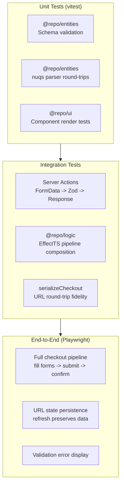

# Testing Plan

## Test Layers



## Package Test Matrix

| Package | Test Type | What to Test |
|---|---|---|
| `@repo/entities` | Unit | Every Zod schema: valid data passes, invalid data rejects with correct errors |
| `@repo/entities` | Unit | Parser serialization: `serializeCheckout` produces correct query strings |
| `@repo/entities` | Unit | Parser deserialization: URL params reconstruct to correct typed objects |
| `@repo/ui` | Unit | Components render with expected CSS module classes |
| `@repo/ui` | Unit | FormField shows error/description states correctly |
| `@repo/logic` (planned) | Integration | EffectTS pipelines: compose validation -> enrichment -> processing |
| `@repo/logic` (planned) | Integration | Error channel propagation: service failures produce typed errors |
| Server Actions | Integration | `submitBuyerAction` validates and returns correct `FormState` |
| Server Actions | Integration | `submitCheckoutAction` serializes and redirects correctly |
| App | E2E | Complete checkout flow from empty URL to confirmation |

## Test Directory Structure (Planned)

```
tests/
  packages/
    entities/
      schemas.test.ts        -- Zod schema validation
      parsers.test.ts        -- nuqs round-trip tests
    ui/
      button.test.tsx        -- Component rendering
      form-field.test.tsx    -- Error state rendering
    logic/                   -- EffectTS pipeline tests
      checkout-pipeline.test.ts
  integration/
    actions.test.ts          -- Server action FormData tests
    serialization.test.ts    -- URL round-trip fidelity
  e2e/
    checkout.spec.ts         -- Playwright full-flow test
    url-state.spec.ts        -- Refresh persistence test
```
