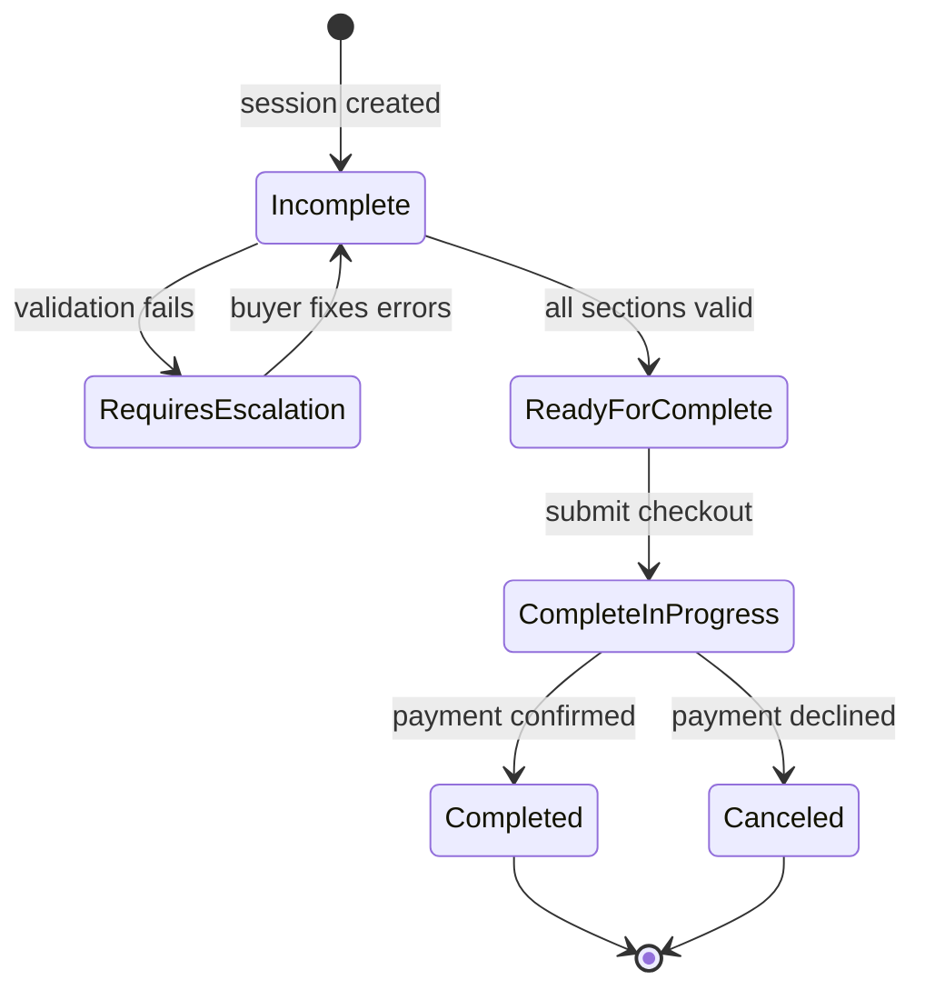
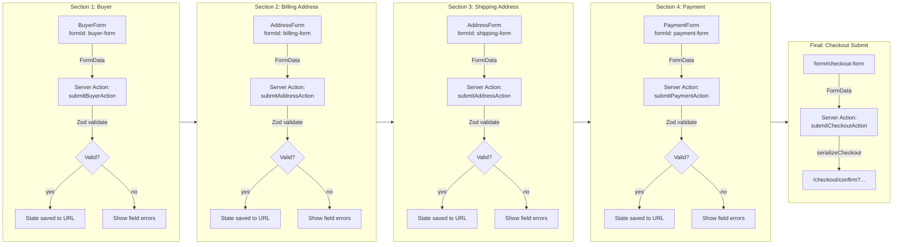
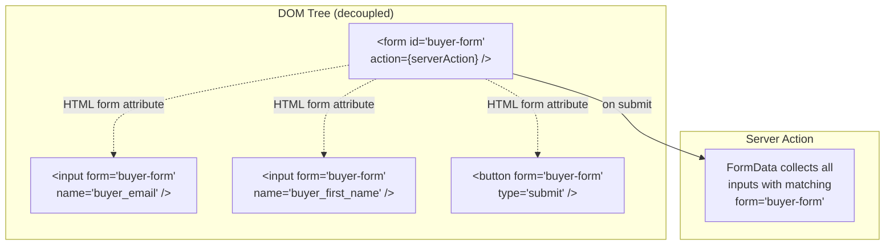
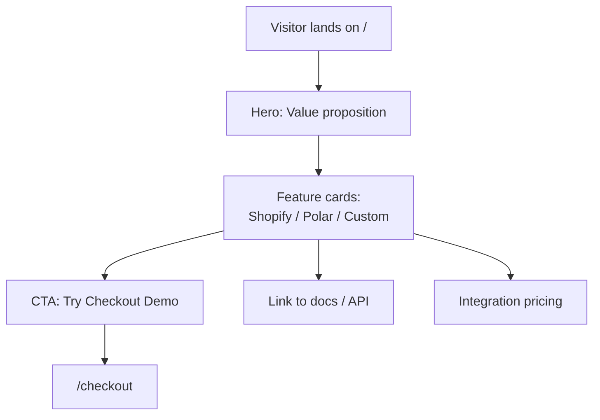
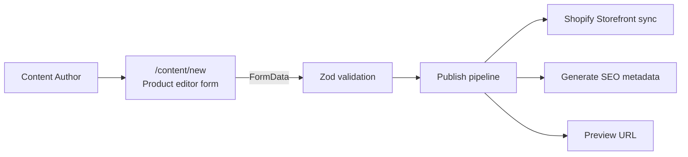
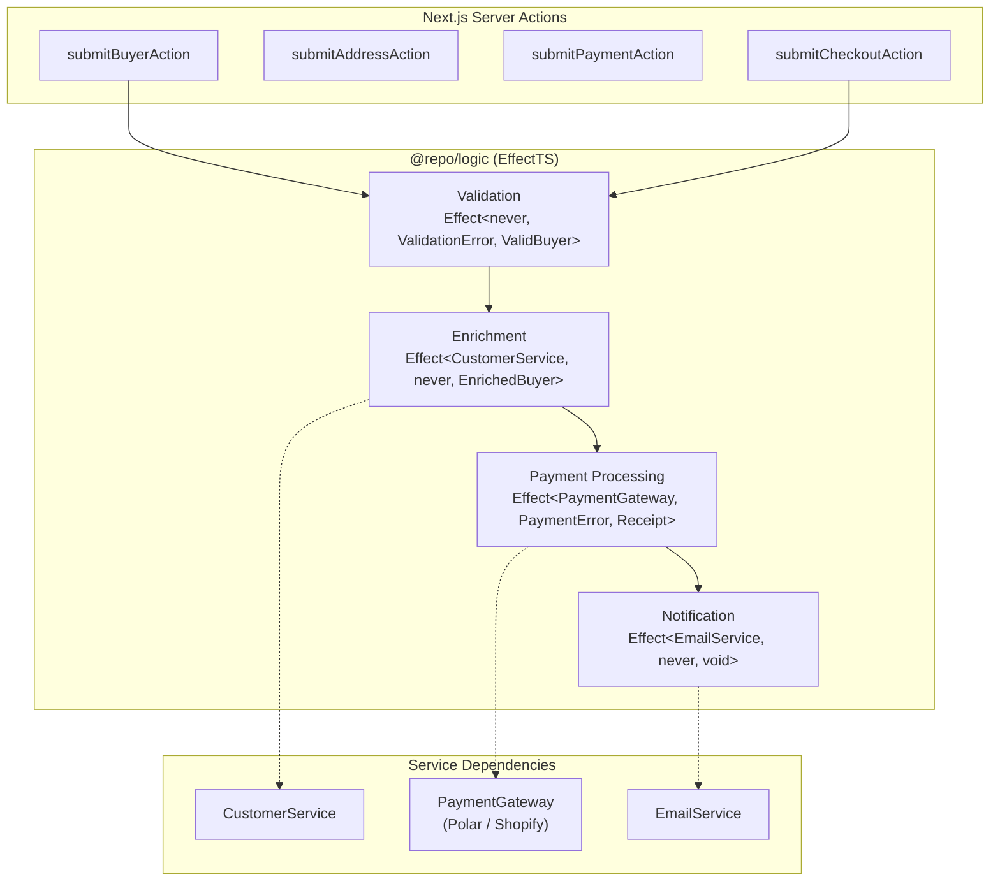
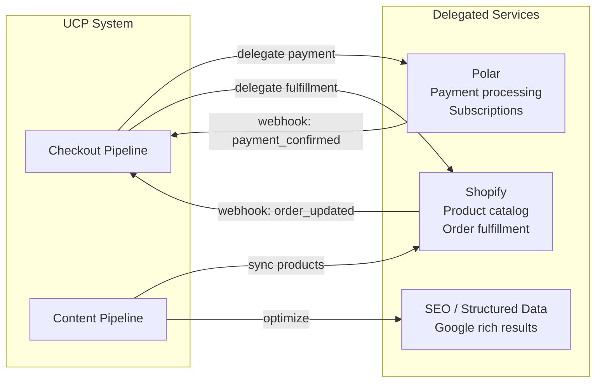

# User Stories & Workflows

## Workflow Definitions (Canonical)

Workflow definitions live in `packages/workflows/registry.ts` and are the canonical, shareable artifacts for checkout/payment flows. Each workflow is a versioned step list that can be used for UI mapping, automation, and observability.

### Standard Format (TS object)

```ts
export interface WorkflowDefinition {
  id: string;
  name: string;
  description: string;
  category: "checkout" | "payment" | "onboarding";
  version: string;
  pipeline_type?: string;
  steps: Array<{
    id: string;
    label: string;
    kind: "page" | "form" | "action" | "api";
    required: boolean;
    description?: string;
    form_ids?: string[];
    action_ids?: string[];
    endpoint?: { method: "GET" | "POST" | "PUT" | "PATCH" | "DELETE"; path: string };
    pipeline_steps?: string[];
  }>;
}
```

### Checkout Form Inventory (Current UI)

| Step | Form ID | Server Action | Notes |
| --- | --- | --- | --- |
| Buyer details | `buyer-form` | `submitBuyerAction` | Buyer identity + contact info |
| Billing address | `billing-form` | `submitAddressAction` | Billing address details |
| Shipping address | `shipping-form` | `submitAddressAction` | Shipping address details |
| Payment details | `payment-form` | `submitPaymentAction` | Payment authorization |
| Checkout submit | `checkout-form` | `submitCheckoutAction` | Final submit + redirect |

Reminder: use `formId` wiring (`form` attribute) for inputs and buttons instead of relying on form children so steps remain decoupled and traceable.

## Checkout Baseline Workflow (Canonical)

The baseline workflow maps the UI steps above to pipeline observability steps (see `@repo/pipeline`).

```json
{
  "id": "checkout_baseline",
  "name": "Checkout Baseline Workflow",
  "pipeline_type": "checkout_physical",
  "steps": [
    { "id": "select_product", "kind": "page", "required": true, "endpoint": { "method": "GET", "path": "/checkout" } },
    { "id": "buyer_details", "kind": "form", "required": true, "form_ids": ["buyer-form"], "pipeline_steps": ["buyer_validated"] },
    { "id": "address_details", "kind": "form", "required": true, "form_ids": ["billing-form", "shipping-form"], "pipeline_steps": ["address_validated"] },
    { "id": "payment_details", "kind": "form", "required": true, "form_ids": ["payment-form"], "pipeline_steps": ["payment_initiated"] },
    { "id": "submit_checkout", "kind": "action", "required": true, "action_ids": ["submitCheckoutAction"], "pipeline_steps": ["payment_confirmed", "checkout_completed"] },
    { "id": "confirmation", "kind": "page", "required": true, "endpoint": { "method": "GET", "path": "/checkout/confirm" } }
  ]
}
```

### cURL/API Automation (Headless Validation)

1) Create a checkout session and receive a checkout URL:

```bash
curl -s http://localhost:3000/api/checkout \\
  -X POST \\
  -H 'Content-Type: application/json' \\
  -d '{
    "currency": "usd",
    "line_items": [
      { "id": "sku_123", "name": "Starter Bundle", "quantity": 1, "unit_price": 4900 }
    ],
    "buyer": { "email": "buyer@example.com", "first_name": "Taylor", "last_name": "Lee" }
  }'
```

2) Visit the `checkout_url` from the response to walk the UI workflow.

3) Track pipeline steps (optional) for observability:

```bash
curl -s http://localhost:3000/api/pipeline/track \\
  -X POST \\
  -H 'Content-Type: application/json' \\
  -d '{
    "event": {
      "id": "chk_123.checkout_physical.buyer_validated.0",
      "session_id": "chk_123",
      "pipeline_type": "checkout_physical",
      "step": "buyer_validated",
      "status": "success",
      "timestamp": "2025-02-01T12:00:00.000Z"
    }
  }'
```

4) Observe pipeline completion status:

```bash
curl -s "http://localhost:3000/api/pipeline/status?session_id=chk_123&pipeline_type=checkout_physical"
```

### How to Add or Extend Workflows

1) Define a new workflow in `packages/workflows/registry.ts` and add it to `WORKFLOW_DEFINITIONS`.
2) Map UI forms/actions via `form_ids` and `action_ids` so steps remain traceable.
3) Link the workflow to a `pipeline_type` where observability is required.
4) Add/extend tests in `packages/workflows/__tests__/registry.test.ts`.
5) Update this doc with the new workflow JSON snippet and any automation notes.

## 1. Checkout Pipeline (Current)

**Goal:** A buyer completes a purchase via UCP-compliant stateless forms.



### Checkout Form Pipeline (Serialized Sections)



### Form wiring via formId



## 2. Marketing Homepage (Planned)

**Goal:** Showcase the UCP system, let merchants discover integration paths.



## 3. Content Publishing (Future)

**Goal:** Create product listings easily, publish to Shopify and make SEO-friendly.



## 4. Business Logic Layer (Planned -- EffectTS)

**Goal:** Govern server-side logic with typed, composable pipelines.



## 5. Integration Map


