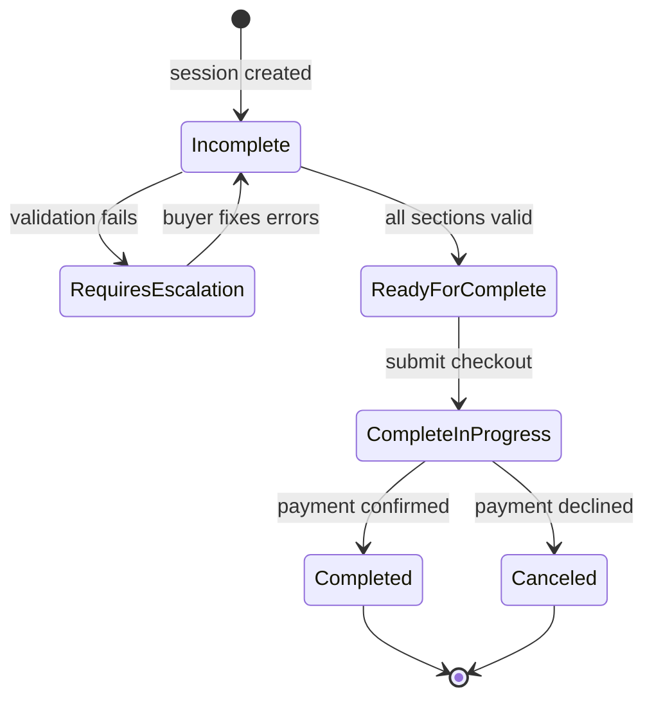
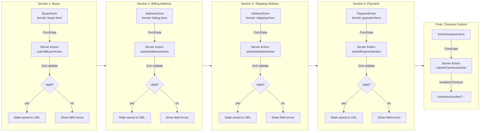
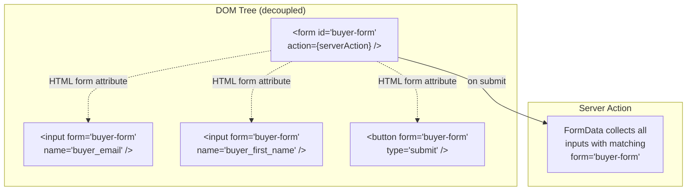
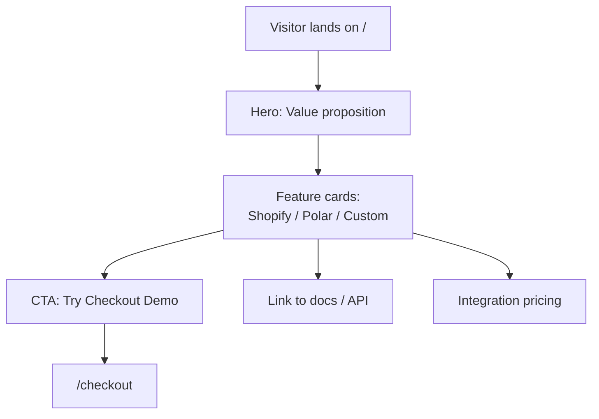
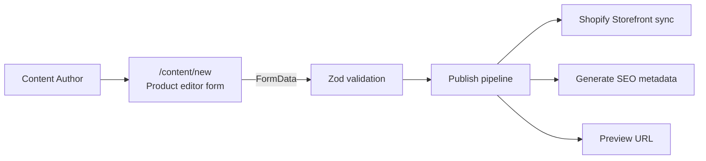
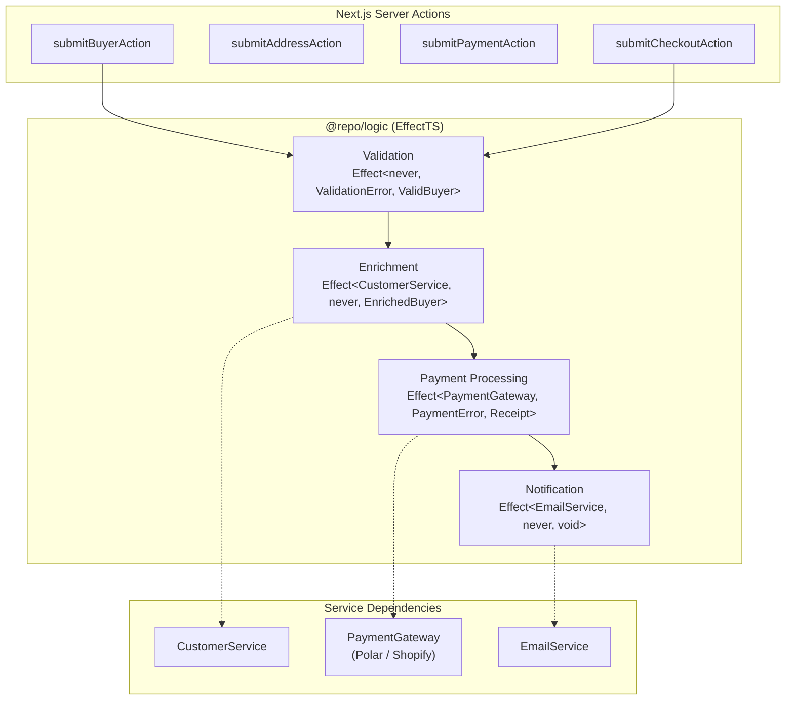
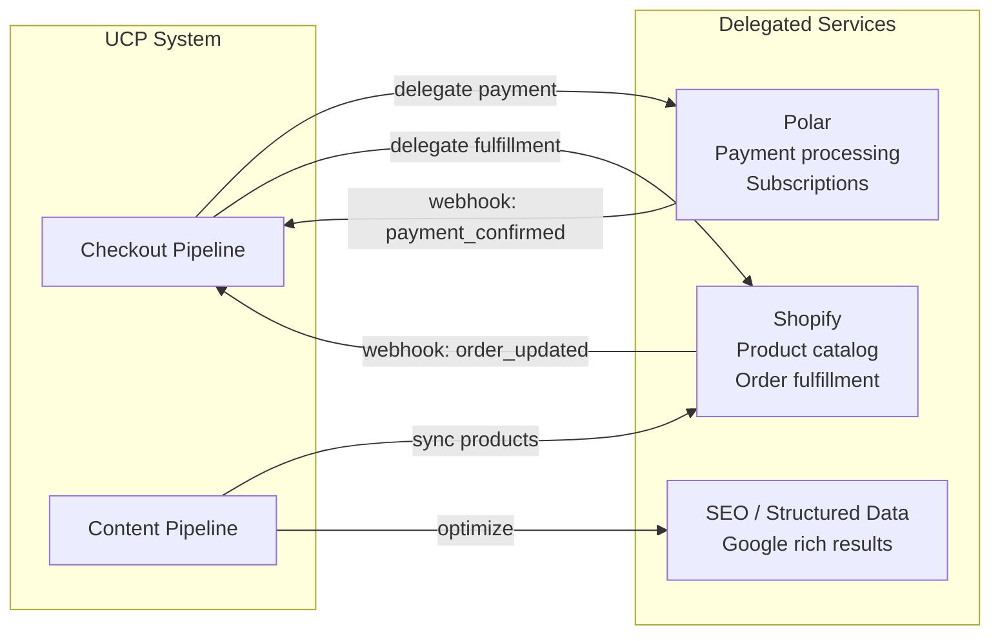

# User Stories & Workflows

## 1. Checkout Pipeline (Current)

**Goal:** A buyer completes a purchase via UCP-compliant stateless forms.

### Checkout Form Pipeline (Serialized Sections)

### Form wiring via formId

## 2. Marketing Homepage (Planned)

**Goal:** Showcase the UCP system, let merchants discover integration paths.

## 3. Content Publishing (Future)

**Goal:** Create product listings easily, publish to Shopify and make SEO-friendly.

## 4. Business Logic Layer (Planned -- EffectTS)

**Goal:** Govern server-side logic with typed, composable pipelines.

## 5. Integration Map

